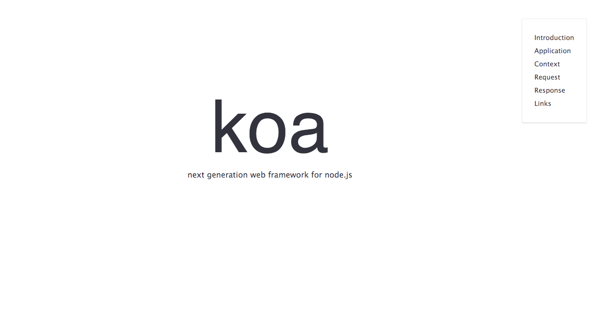

#Koa.js

I've copied your koajs.html file here from the previous lesson. Style it up!

## Notes:

- The top logo isn't an image, but is simply using a custom font. Don't worry about bringing in webfonts just yet - we'll get to that in a later exercise. (see below)
- Don't worry about the hamburger menu. For the sake of this exercise, simply have a static box keeping the nav in the top right (fixed). (see below)
- Feel free to modify your HTML. You may decide to add classes, change the semantics, add wrapping divs, or something else. Coding up the CSS often reveals flaws sore spots in HTML.

